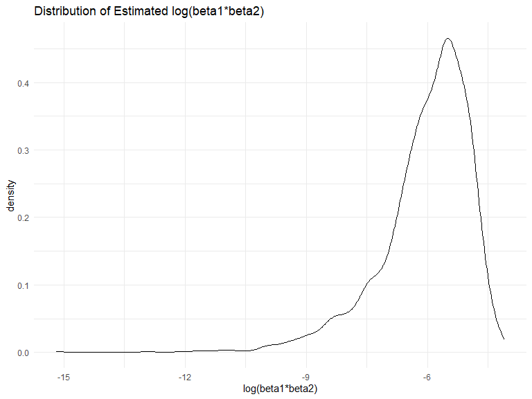

p8105_hw6_zz3167
================
Zhiyi Zhu
2023-11-30

### Problem 1

In the data cleaning code below we create a `city_state` variable,
change `victim_age` to numeric, modifiy victim_race to have categories
white and non-white, with white as the reference category, and create a
`resolution` variable indicating whether the homicide is solved. Lastly,
we filtered out the following cities: Tulsa, AL; Dallas, TX; Phoenix,
AZ; and Kansas City, MO; and we retained only the variables
`city_state`, `resolution`, `victim_age`, `victim_sex`, and
`victim_race`.

``` r
homicide_df = 
  read_csv("data/homicide-data.csv", na = c("", "NA", "Unknown")) |> 
  mutate(
    city_state = str_c(city, state, sep = ", "),
    victim_age = as.numeric(victim_age),
    resolution = case_when(
      disposition == "Closed without arrest" ~ 0,
      disposition == "Open/No arrest"        ~ 0,
      disposition == "Closed by arrest"      ~ 1)
  ) |> 
  filter(victim_race %in% c("White", "Black")) |> 
  filter(!(city_state %in% c("Tulsa, AL", "Dallas, TX", "Phoenix, AZ", "Kansas City, MO"))) |> 
  select(city_state, resolution, victim_age, victim_sex, victim_race)
```

    ## Rows: 52179 Columns: 12
    ## ── Column specification ────────────────────────────────────────────────────────
    ## Delimiter: ","
    ## chr (8): uid, victim_last, victim_first, victim_race, victim_sex, city, stat...
    ## dbl (4): reported_date, victim_age, lat, lon
    ## 
    ## ℹ Use `spec()` to retrieve the full column specification for this data.
    ## ℹ Specify the column types or set `show_col_types = FALSE` to quiet this message.

Next we fit a logistic regression model using only data from Baltimore,
MD. We model `resolved` as the outcome and `victim_age`, `victim_sex`,
and `victim_race` as predictors. We save the output as `baltimore_glm`
so that we can apply `broom::tidy` to this object and obtain the
estimate and confidence interval of the adjusted odds ratio for solving
homicides comparing non-white victims to white victims.

``` r
baltimore_glm = 
  filter(homicide_df, city_state == "Baltimore, MD") |> 
  glm(resolution ~ victim_age + victim_sex + victim_race, family = binomial(), data = _)

baltimore_glm |> 
  broom::tidy() |> 
  mutate(
    OR = exp(estimate), 
    OR_CI_upper = exp(estimate + 1.96 * std.error),
    OR_CI_lower = exp(estimate - 1.96 * std.error)) |> 
  filter(term == "victim_sexMale") |> 
  select(OR, OR_CI_lower, OR_CI_upper) |>
  knitr::kable(digits = 3)
```

|    OR | OR_CI_lower | OR_CI_upper |
|------:|------------:|------------:|
| 0.426 |       0.325 |       0.558 |

Below, by incorporating `nest()`, `map()`, and `unnest()` into the
preceding Baltimore-specific code, we fit a model for each of the
cities, and extract the adjusted odds ratio (and CI) for solving
homicides comparing non-white victims to white victims. We show the
first 5 rows of the resulting dataframe of model results.

``` r
model_results = 
  homicide_df |> 
  nest(data = -city_state) |> 
  mutate(
    models = map(data, \(df) glm(resolution ~ victim_age + victim_sex + victim_race, 
                             family = binomial(), data = df)),
    tidy_models = map(models, broom::tidy)) |> 
  select(-models, -data) |> 
  unnest(cols = tidy_models) |> 
  mutate(
    OR = exp(estimate), 
    OR_CI_upper = exp(estimate + 1.96 * std.error),
    OR_CI_lower = exp(estimate - 1.96 * std.error)) |> 
  filter(term == "victim_sexMale") |> 
  select(city_state, OR, OR_CI_lower, OR_CI_upper)

model_results |>
  slice(1:5) |> 
  knitr::kable(digits = 3)
```

| city_state      |    OR | OR_CI_lower | OR_CI_upper |
|:----------------|------:|------------:|------------:|
| Albuquerque, NM | 1.767 |       0.831 |       3.761 |
| Atlanta, GA     | 1.000 |       0.684 |       1.463 |
| Baltimore, MD   | 0.426 |       0.325 |       0.558 |
| Baton Rouge, LA | 0.381 |       0.209 |       0.695 |
| Birmingham, AL  | 0.870 |       0.574 |       1.318 |

Below we generate a plot of the estimated ORs and CIs for each city,
ordered by magnitude of the OR from smallest to largest. From this plot
we see that most cities have odds ratios that are smaller than 1,
suggesting that crimes with male victims have smaller odds of resolution
compared to crimes with female victims after adjusting for victim age
and race. This disparity is strongest in New yrok. In roughly half of
these cities, confidence intervals are narrow and do not contain 1,
suggesting a significant difference in resolution rates by sex after
adjustment for victim age and race.

``` r
model_results |> 
  mutate(city_state = fct_reorder(city_state, OR)) |> 
  ggplot(aes(x = city_state, y = OR)) + 
  geom_point() + 
  geom_errorbar(aes(ymin = OR_CI_lower, ymax = OR_CI_upper)) + 
  theme(axis.text.x = element_text(angle = 90, hjust = 1))
```


### Problem 2

#### Import data

``` r
# Download the Central Park weather data
weather_df = 
  rnoaa::meteo_pull_monitors(
    c("USW00094728"),
    var = c("PRCP", "TMIN", "TMAX"), 
    date_min = "2022-01-01",
    date_max = "2022-12-31") |>
  mutate(
    name = recode(id, USW00094728 = "CentralPark_NY"),
    tmin = tmin / 10,
    tmax = tmax / 10) |>
  select(name, id, everything())
```

    ## using cached file: C:\Users\HUAWEI\AppData\Local/R/cache/R/rnoaa/noaa_ghcnd/USW00094728.dly

    ## date created (size, mb): 2023-10-03 16:10:10.639154 (8.542)

    ## file min/max dates: 1869-01-01 / 2023-09-30

The boostrap is helpful when you’d like to perform inference for a
parameter / value / summary that doesn’t have an easy-to-write-down
distribution in the usual repeated sampling framework. We’ll focus on a
simple linear regression with `tmax` as the response with `tmin` and
`prcp` as the predictors, and are interested in the distribution of two
quantities estimated from these data:

- r̂2
- log(β̂1∗β̂2)

Use 5000 bootstrap samples and, for each bootstrap sample, produce
estimates of these two quantities. Plot the distribution of your
estimates, and describe these in words. Using the 5000 bootstrap
estimates, identify the 2.5% and 97.5% quantiles to provide a 95%
confidence interval for r̂2 and log(β̂1∗β̂2). Note: `broom::glance()` is
helpful for extracting r̂2 from a fitted regression, and `broom::tidy()`
(with some additional wrangling) should help in computing log(β̂1∗β̂2).

#### Use bootstrap samples to produce estimates

``` r
boot_strap_df = 
  weather_df |> 
  modelr::bootstrap(n = 5000) |> 
  mutate(
    models = map(strap, \(df) lm(tmax ~ tmin + prcp, data = df))) 
 

r_squared_df = 
  boot_strap_df |>
  mutate(results = map(models, broom::glance)) |>
  select(-strap, -models) |>
  unnest(results)

log_beta_df = 
  boot_strap_df |>
  mutate(results = map(models, broom::tidy)) |>
  select(-strap, -models) |>
  unnest(results) |>
  select(.id, term, estimate) |>
  pivot_wider(
    names_from = term,
    values_from = estimate
  ) |>
  mutate(log_beta_pro = log(tmin * prcp))

r_squared_result = 
  r_squared_df |>
  summarize(r_squared_estimate = mean(r.squared))

log_b1b2_result = 
  log_beta_df|>
  summarize(log_b1b2_estimate = mean(log_beta_pro, na.rm = TRUE))

r_squared_result |>
  knitr::kable()
```

| r_squared_estimate |
|-------------------:|
|          0.9170798 |

``` r
log_b1b2_result |>
  knitr::kable()
```

| log_b1b2_estimate |
|------------------:|
|         -6.057255 |

- Comment:For log(β1\*β2), there are 3329 non-finite values, and
  calculation of parameter statistics is performed on the non-NA values.

#### Plot the distribution of your estimates

``` r
# Distribution of r squared estimates
r_squared_df |>
  ggplot(aes(x = r.squared)) +
  geom_density() +
  labs(
    title = "Distribution of Estimated R Squared" ,x = "R Squared Estimates")
```


- Describe the plot: The distribution is approximately normal
  distribution and left-skewed. We observe that r^2 values are close to
  0.92, indicating a strong linear relationship. This suggests that both
  ‘tmin’ and ‘prcp’ serve as reliable indicators of ‘tmax’.

``` r
# Distribution of log(b1b2) estimates
log_beta_df |>
  na.omit() |>
  ggplot(aes(x = log_beta_pro)) +
  geom_density() +
  labs(title = "Distribution of Estimated log(beta1*beta2)", x = "log(beta1*beta2)")
```



- Describe the plot: The distribution is concentrated near -5 but has a
  heavy tail extending to low values, which may be related to the
  outliers included in the bootstrap sample.

#### Provide a 95% confidence interval

``` r
r_squared_df |>
  summarize(
    r2_CI_lower = quantile(r.squared, 0.025),
    r2_CI_upper = quantile(r.squared, 0.975)
  ) |>
  knitr::kable()
```

| r2_CI_lower | r2_CI_upper |
|------------:|------------:|
|   0.8881057 |   0.9409823 |

``` r
log_beta_df |>
  na.omit() |>
  summarize(
    log_b1b2_CI_lower = quantile(log_beta_pro, 0.025),
    log_b1b2_CI_upper = quantile(log_beta_pro, 0.975)) |>
  knitr::kable()
```

| log_b1b2_CI_lower | log_b1b2_CI_upper |
|------------------:|------------------:|
|         -8.933695 |         -4.581701 |

### Problem 3

#### Load and clean the data

``` r
#load and clean data
birth_weight = 
  read_csv("data/birthweight.csv") |>
  janitor::clean_names() |> 
  mutate(
    babysex = case_match(
      babysex,
      1 ~ 'male',
      2 ~ 'female'),
    frace = case_match(
      frace, 
      1 ~ "White", 
      2 ~ "Black", 
      3 ~ "Asian", 
      4 ~ "Puerto Rican", 
      8 ~ "Other", 
      9 ~ "Unknown"),
    malform = case_match(
      malform, 
      0 ~ 'absent',
      1 ~ 'present'),
    mrace = case_match(
      mrace, 
      1 ~ "White", 
      2 ~ "Black", 
      3 ~ "Asian", 
      4 ~ "Puerto Rican", 
      8 ~ "Other"))
```

    ## Rows: 4342 Columns: 20
    ## ── Column specification ────────────────────────────────────────────────────────
    ## Delimiter: ","
    ## dbl (20): babysex, bhead, blength, bwt, delwt, fincome, frace, gaweeks, malf...
    ## 
    ## ℹ Use `spec()` to retrieve the full column specification for this data.
    ## ℹ Specify the column types or set `show_col_types = FALSE` to quiet this message.

``` r
# check NAs
sum(is.na(birth_weight))
```

    ## [1] 0

There’s no missing values in this dataset.

#### Propose a regression model for birthweight

``` r
full_model = 
  lm(bwt ~ ., data = birth_weight) 

full_model |>
  broom::tidy() |>
  knitr::kable() 
```

| term              |      estimate |   std.error |  statistic |   p.value |
|:------------------|--------------:|------------:|-----------:|----------:|
| (Intercept)       | -6306.8345949 | 659.2639908 | -9.5664782 | 0.0000000 |
| babysexmale       |   -28.7073088 |   8.4652447 | -3.3911966 | 0.0007021 |
| bhead             |   130.7781455 |   3.4523248 | 37.8811826 | 0.0000000 |
| blength           |    74.9535780 |   2.0216656 | 37.0751613 | 0.0000000 |
| delwt             |     4.1007326 |   0.3948202 | 10.3863301 | 0.0000000 |
| fincome           |     0.2898207 |   0.1795416 |  1.6142265 | 0.1065513 |
| fraceBlack        |    -6.9048265 |  78.8349060 | -0.0875859 | 0.9302099 |
| fraceOther        |   -16.9391876 |  97.5931709 | -0.1735694 | 0.8622120 |
| fracePuerto Rican |   -68.2323428 |  78.4692463 | -0.8695425 | 0.3845988 |
| fraceWhite        |   -21.2361118 |  69.2959907 | -0.3064551 | 0.7592729 |
| gaweeks           |    11.5493872 |   1.4653680 |  7.8815609 | 0.0000000 |
| malformpresent    |     9.7649680 |  70.6258929 |  0.1382633 | 0.8900388 |
| menarche          |    -3.5507723 |   2.8950777 | -1.2264860 | 0.2200827 |
| mheight           |     9.7874130 |  10.3115672 |  0.9491683 | 0.3425881 |
| momage            |     0.7593479 |   1.2221417 |  0.6213256 | 0.5344182 |
| mraceBlack        |   -60.0487959 |  80.9532075 | -0.7417717 | 0.4582660 |
| mracePuerto Rican |    34.9078811 |  80.9480792 |  0.4312379 | 0.6663169 |
| mraceWhite        |    91.3866079 |  71.9189677 |  1.2706885 | 0.2039079 |
| parity            |    95.5411137 |  40.4792711 |  2.3602479 | 0.0183069 |
| pnumlbw           |            NA |          NA |         NA |        NA |
| pnumsga           |            NA |          NA |         NA |        NA |
| ppbmi             |     4.3537865 |  14.8913292 |  0.2923706 | 0.7700173 |
| ppwt              |    -3.4715550 |   2.6121254 | -1.3290155 | 0.1839131 |
| smoken            |    -4.8543629 |   0.5870549 | -8.2690107 | 0.0000000 |
| wtgain            |            NA |          NA |         NA |        NA |

``` r
stepwise_model = 
  full_model |>
  MASS::stepAIC(direction = "backward", trace = FALSE)

stepwise_model |>
  broom::tidy() |>
  knitr::kable()
```

| term              |      estimate |   std.error |   statistic |   p.value |
|:------------------|--------------:|------------:|------------:|----------:|
| (Intercept)       | -6145.1506698 | 141.9496468 | -43.2910599 | 0.0000000 |
| babysexmale       |   -28.5580171 |   8.4548958 |  -3.3776900 | 0.0007374 |
| bhead             |   130.7770408 |   3.4465672 |  37.9441440 | 0.0000000 |
| blength           |    74.9471109 |   2.0190479 |  37.1200270 | 0.0000000 |
| delwt             |     4.1067316 |   0.3920592 |  10.4747754 | 0.0000000 |
| fincome           |     0.3180229 |   0.1747477 |   1.8198980 | 0.0688436 |
| gaweeks           |    11.5924873 |   1.4620657 |   7.9288417 | 0.0000000 |
| mheight           |     6.5940377 |   1.7848817 |   3.6943835 | 0.0002231 |
| mraceBlack        |   -63.9057046 |  42.3662612 |  -1.5084103 | 0.1315225 |
| mracePuerto Rican |   -25.7913672 |  45.3501537 |  -0.5687162 | 0.5695783 |
| mraceWhite        |    74.8867755 |  42.3146313 |   1.7697608 | 0.0768374 |
| parity            |    96.3046933 |  40.3362158 |   2.3875490 | 0.0170038 |
| ppwt              |    -2.6755853 |   0.4273585 |  -6.2607517 | 0.0000000 |
| smoken            |    -4.8434197 |   0.5855757 |  -8.2712102 | 0.0000000 |

- Describe modeling process: First, I fit a linear model with all the
  other variables as predictors. Then, using `stepwiseAIC` function to
  perform stepwise model selection based on the full model. From the
  result table, the selected predictors are: `babysex`, `bhead`,
  `blength`, `delwt`, `fincome`, `gaweeks`, `mheight`, `mrace`,
  `parity`, `ppwt`, `smoken`.

#### Show a plot of model residuals against fitted values

``` r
birth_weight |> 
    add_predictions(stepwise_model) |> 
    add_residuals(stepwise_model) |> 
    ggplot(aes(x = pred, y = resid)) +
    geom_point()  + 
    geom_smooth(method = "lm",se = FALSE) + 
    labs(title = "Residuals versus Fitted Values", 
       x = "Predictions", 
       y = "Residuals")
```

    ## `geom_smooth()` using formula = 'y ~ x'


#### Compare your model to two others:

- One using length at birth and gestational age as predictors (main
  effects only)
- One using head circumference, length, sex, and all interactions
  (including the three-way interaction) between these

``` r
model_1 = lm(bwt ~ blength + gaweeks, data = birth_weight)

model_1 |>
  broom::tidy() |>
  knitr::kable()
```

| term        |    estimate | std.error | statistic | p.value |
|:------------|------------:|----------:|----------:|--------:|
| (Intercept) | -4347.66707 | 97.958360 | -44.38281 |       0 |
| blength     |   128.55569 |  1.989891 |  64.60439 |       0 |
| gaweeks     |    27.04673 |  1.717930 |  15.74379 |       0 |

``` r
model_2 = lm(bwt ~ bhead * blength * babysex, data = birth_weight)

model_2 |>
  broom::tidy() |>
  knitr::kable()
```

| term                      |     estimate |    std.error |  statistic |   p.value |
|:--------------------------|-------------:|-------------:|-----------:|----------:|
| (Intercept)               |  -801.948671 | 1102.3077046 | -0.7275180 | 0.4669480 |
| bhead                     |   -16.597546 |   34.0916082 | -0.4868514 | 0.6263883 |
| blength                   |   -21.645964 |   23.3720477 | -0.9261475 | 0.3544209 |
| babysexmale               | -6374.868351 | 1677.7669213 | -3.7996150 | 0.0001469 |
| bhead:blength             |     3.324444 |    0.7125586 |  4.6655020 | 0.0000032 |
| bhead:babysexmale         |   198.393181 |   51.0916850 |  3.8830816 | 0.0001047 |
| blength:babysexmale       |   123.772887 |   35.1185360 |  3.5244319 | 0.0004288 |
| bhead:blength:babysexmale |    -3.878053 |    1.0566296 | -3.6702106 | 0.0002453 |

- Make this comparison in terms of the cross-validated prediction error

``` r
cv_df =
  crossv_mc(birth_weight, 100) |>
  mutate(
    train = map(train, as_tibble),
    test = map(test, as_tibble))

compare_df = 
  cv_df |>
  mutate(
    model_0  = map(train, ~lm(bwt ~ babysex + bhead + blength + delwt + fincome + gaweeks + mheight + mrace + parity + ppwt + smoken, data = .x)),
    model_1  = map(train, ~lm(bwt ~ gaweeks + blength, data = .x)),
    model_2  = map(train, ~lm(bwt ~ bhead*blength*babysex, data = .x))) |>
  mutate(
    rmse_0 = map2_dbl(model_0, test, ~rmse(model = .x, data = .y)),
    rmse_1 = map2_dbl(model_1, test, ~rmse(model = .x, data = .y)),
    rmse_2 = map2_dbl(model_2, test, ~rmse(model = .x, data = .y))) 

compare_df |>
  summarize(
    mean_rmse_0 = mean(rmse_0),
    mean_rmse_1 = mean(rmse_1),
    mean_rmse_2  = mean(rmse_2)
  ) |>
  knitr::kable()
```

| mean_rmse_0 | mean_rmse_1 | mean_rmse_2 |
|------------:|------------:|------------:|
|    272.9113 |    333.9683 |    289.0043 |

``` r
compare_df |>
  select(starts_with("rmse")) |>
  mutate(
    model_0 = rmse_0,
    model_1 = rmse_1,
    model_2 = rmse_2
  ) |>
  pivot_longer(
    model_0:model_2,
    names_to = "model",
    values_to = "rmse"
  ) |>
  ggplot(aes(x = model, y = rmse)) +
  geom_violin(aes(fill = model)) +
  labs(
    title = "RMSE of 3 Different Models"
  )
```


- Comment: From the plot, we could conclude that model_0 (which
  construct using stepwiseAIC) has the smallest RMSE. The model_1 (using
  `gaweeks` and `blength` as predictors) has the largest RMSE. It
  indicates that model_0 is the most reliable one to fit.
